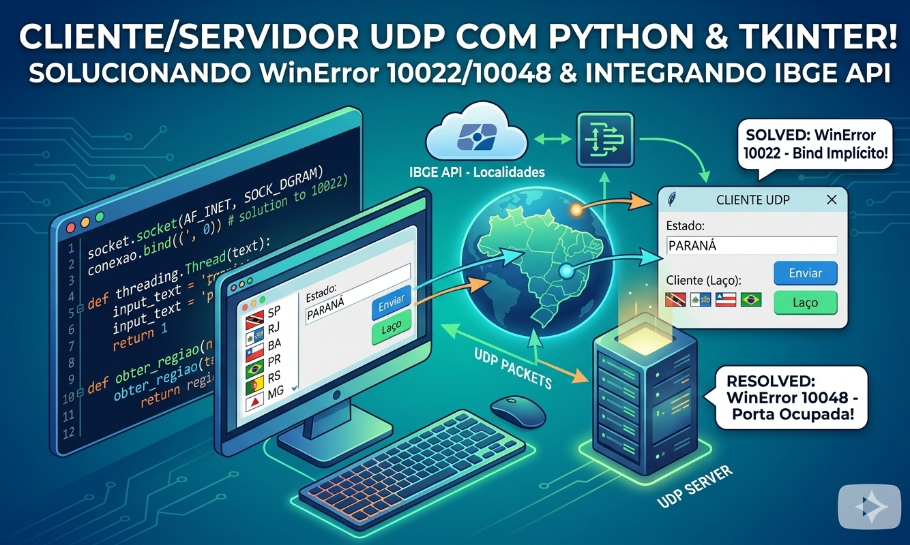

# 🌍 Consulta de Regiões IBGE (API) - Cliente/Servidor UDP

Este projeto implementa uma arquitetura de comunicação em rede utilizando o protocolo UDP, onde um cliente (Interface Gráfica) solicita a região geográfica de estados brasileiros a um servidor, que por sua vez consome a API oficial do IBGE.

*Clique na imagem acima para assistir ao processo de desenvolvimento e solução dos erros.*

Vídeo do Protocolo UDP: https://youtu.be/xjVzG6IpeBY

### Funcionalidades
- Servidor Multithread: Capaz de processar múltiplas requisições simultâneas via threads.

- Integração com API: Consulta em tempo real aos dados de localidades do IBGE.

- Modo Laço (Automação): O cliente possui um modo de envio contínuo que sorteia estados de um arquivo local e consulta o servidor automaticamente.

- Interface Gráfica (Tkinter): Visualização clara das mensagens enviadas e recebidas.

#### Processos Técnicos
1. Fluxo de Comunicação
A comunicação utiliza Sockets UDP. Diferente do TCP, o UDP não estabelece uma conexão persistente, o que o torna mais rápido, porém exige maior cuidado no tratamento de pacotes e estados do socket.

2. O Desafio do "WinError 10022"
Durante o desenvolvimento, identificou-se que no Windows, um socket UDP que tenta receber dados (recvfrom) sem uma identidade definida gera um erro de argumento inválido.

Solução: Implementação do Bind Implícito no cliente através de conexao.bind(('', 0)), garantindo que o Sistema Operacional atribua uma porta ao cliente antes do início da thread de escuta.

3. Concorrência e Interface Gráfica
Para evitar que a interface do usuário (GUI) travasse durante a espera por uma resposta de rede, utilizamos o módulo threading:

- Thread de Recepção: Monitora o socket continuamente.

- Thread de Laço: Gerencia o envio automatizado sem interromper a interação do usuário.

- Thread-Safety: Uso do método .after() do Tkinter para atualizar elementos visuais a partir de threads secundárias.

#### Aprendizados Principais
###### Protocolo UDP
Portas Efêmeras: O cliente ganha uma porta aleatória para receber a resposta do servidor e que essa porta muda se o socket for reiniciado.

###### Datagramas: 
A importância de definir tamanhos de buffer (ex: 2048 bytes) adequados para o recebimento de mensagens.

###### Programação em Rede no Windows vs Linux:
A necessidade de vincular (bind) o socket no lado do cliente para operações de recebimento, uma particularidade da stack de rede do Windows para evitar erros de inicialização.

###### Integração com APIs Externas
Tratamento de latência: Como o servidor depende de uma resposta HTTP do IBGE, a arquitetura multithread do servidor é essencial para não enfileirar (bloquear) outros clientes enquanto aguarda a API.

### Estrutura do Projeto
    servidor.py: 
    # Gerencia as requisições UDP e dispara threads de serviço.
    
    servico_servidor.py: 
    # Lógica de consumo da API do IBGE usando a biblioteca requests.
    
    cliente.py: 
    # Interface GUI, gerenciamento de threads de envio/recepção e leitura do arquivo de estados.
    
    cliente.py: 
    # Interface GUI com um laço que busca um nome de estado no arquivo 'palavras' e faz a requisição no IBGE.
    
    palavras.txt: 
    # Banco de dados simples com nomes de estados para o modo laço.

---

Nota: Este projeto foi desenvolvido para fins didáticos na disciplina de Computação Distribuída.