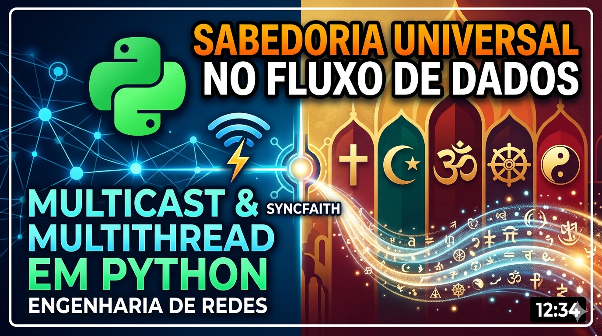

# SyncFaith: Multicast Multithreading & Universal Wisdom
Este pequeno estudo é uma prova de conceito que une engenharia de rede de baixa latência (UDP Multicast) com uma reflexão filosófica sobre a convergência das grandes tradições espirituais.

*Clique na imagem acima para assistir ao vídeo do projeto em funcionamento.*

---
## 🧠 O Aprendizado Técnico
O desenvolvimento deste sistema permitiu explorar três pilares fundamentais da computação distribuída:

### UDP Multicast (RFC 1112): 
Diferente do Unicast (um-para-um), o Multicast permite que uma única transmissão alcance múltiplos receptores simultaneamente. Aprendemos a manipular o TTL (Time To Live) e a utilizar o protocolo IGMP para que o cliente se "inscreva" em um grupo de rede (224.1.1.7).

### Multithreading em Python: 
A implementação de threads (threading.Thread) foi crucial para desacoplar a Interface de Usuário (Menu) da Lógica de Transmissão. Isso garante que o servidor possa continuar operando enquanto os dados são transmitidos em background, simulando o comportamento de sistemas de alta performance.

### Socket Programming: 
O desafio do "bind" e da interface correta nos ensinou que a rede é uma camada física viva, onde configurações de firewall e interfaces de rede (Wi-Fi vs Ethernet) ditam o sucesso da comunicação.

## 🕊️ A Filosofia: Sincronia nas Mensagens
O aspecto mais profundo deste projeto surge quando olhamos para os dados transmitidos. Ao utilizar arquivos .txt de diferentes religiões (Bíblia, Alcorão, Budismo, Taoismo, etc.), o sistema revela uma verdade oculta:

No nível dos pacotes, a sabedoria é indistinguível.

Ao transmitir mensagens religiosas via UDP, os bits não carregam dogmas, apenas informações. Quando o cliente recebe essas mensagens em uma "corrente" contínua, as fronteiras entre as religiões começam a se dissolver:

O conceito de paz interior do Budismo ecoa no refrigério da alma do Cristianismo.

A ação sem apego do Hinduísmo se mistura à caridade Espírita.

O fluxo da natureza do Taoismo encontra a ordem divina do Islã.

Ao misturarmos as threads de transmissão, criamos um "Multicast Universal", onde o receptor não vê mais rótulos, mas sim um fluxo constante de ética, compaixão e busca pelo sentido da vida. Este projeto mostra que, assim como os pacotes de rede convergem para o mesmo endereço IP, as religiões, em sua essência, convergem para a mesma experiência humana.

###️ Como Executar
Pré-requisitos
Python 3.10+

Arquivos de texto na pasta raiz (biblia.txt, budista.txt, etc.)

Servidor (O Transmissor)
O servidor permite escolher qual "frequência" espiritual transmitir.

        python God.py

Cliente (O Receptor)
O cliente sintoniza no grupo 224.1.1.7:50000 e recebe o fluxo misto de sabedoria.

        python human.py

*Desenvolvido como um estudo de redes e humanidades.*